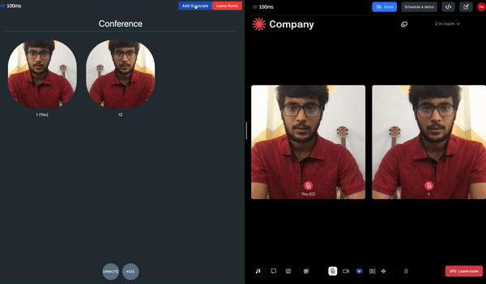

# 100ms-face-filters


Fork of 100ms [quickstart guide](https://docs.100ms.live/javascript/v2/guides/react-quickstart).

Implements HMSVideoPlugin to add a grayscale filter.

Deployed [here](https://hms-face-filters.netlify.app/).
Codesandbox [here](https://codesandbox.io/s/github/triptu/100ms-face-filters).
100ms Plugins Documentation [here](https://docs.100ms.live/javascript/v2/plugins/custom-video-plugins).

To try out the app for free, create a 100ms account to get a sample token by following
the steps [here](https://docs.100ms.live/javascript/v2/guides/token).

## Demo:

* Grayscale Filter



## Running locally

Install the packages -

```sh
yarn install
```

Start the dev server -

```sh
yarn start
```
